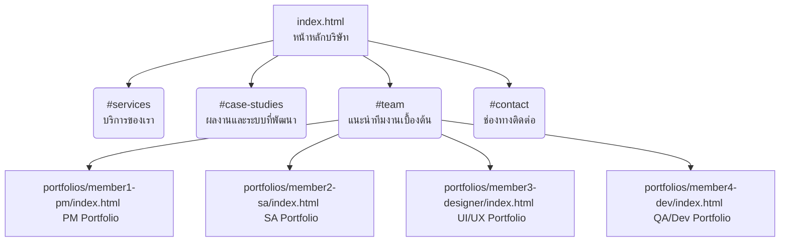

# System Analyst & Tech Lead Report 
**Project:** QuadraCraft Studio
**Role:** Member 2 (System Analyst / Tech Lead)
**Prepared By:** Aukit Tantisuparak

---

## 1. Sitemap & Navigation Structure
โครงสร้างหน้าเว็บไซต์ (Sitemap) ถูกออกแบบโดยเน้นให้ผู้ใช้งานสามารถเข้าถึงข้อมูลของบริษัท บริการ และผลงานได้อย่างรวดเร็ว โดยมีการเชื่อมโยงไปยังหน้าโปรไฟล์ของทีมงานแต่ละคนอย่างเป็นระบบ

## 2. User Flow (เส้นทางการใช้งานของผู้ใช้)
การออกแบบ User Flow สำหรับผู้ใช้ที่เข้ามาเยี่ยมชมเว็บไซต์ QuadraCraft Studio:

1. **Landing & Hero Section:** ผู้ใช้เข้าสู่ `index.html` จะพบกับวิสัยทัศน์และจุดเด่นของทีม 
2. **Explore Services:** เลื่อนลงมาเพื่อดูบริการหลัก (Enterprise POS, Web/Mobile Apps, Cloud, BI)
3. **Review Case Studies:** ชมผลงานเด่น (เช่น NexPOS 360 ของ 7-Eleven) เพื่อดูศักยภาพและ Tech Stack ที่ใช้
4. **Meet the Team:** ผู้ใช้สามารถดูโปรไฟล์ย่อของสมาชิกทั้ง 4 คน และกดที่การ์ดของสมาชิกเพื่อเข้าไปดูผลงานรายบุคคลอย่างละเอียด (`portfolios/memberX/index.html`) ได้ทันที
5. **Contact / CTA:** ท้ายหน้าจอมีช่องทางติดต่อเพื่อเริ่มโปรเจกต์ใหม่ (Start a Project)

## 3. Services & Case Studies Content Review
เนื้อหาในส่วนบริการและผลงานได้รับการตรวจสอบและจัดวางให้ตรงกับขอบเขตงาน (Scope) ที่วางไว้:
- **Services:** ครอบคลุม 5 เสาหลัก คือ POS & Retail, Web Apps, Mobile Apps, Cloud & DevOps, และ BI & Analytics
- **Featured Case Study:** ระบบ `NexPOS 360` สำหรับ 7-Eleven (Distributed Retail POS System) ถูกจัดวางเป็นผลงานชูโรง มีการระบุ Tech Stack (Microservices, Real-time Sync) อย่างชัดเจนเพื่อสร้างความน่าเชื่อถือ
- **Additional Cases:** มีระบบ OmniStore Cloud Commerce, CareSync Pro (Medical) และ InsightPulse Analytics ซึ่งแสดงให้เห็นถึงความสามารถที่ครอบคลุมหลายอุตสาหกรรม

## 4. Code Structure & Navigation Audit
การตรวจสอบโครงสร้างโค้ดและการเชื่อมโยง (Tech Lead Review):

- [x] **Semantic HTML:** ตรวจสอบและปรับปรุงโครงสร้าง `index.html` ให้ใช้ Semantic tags (`<nav>`, `<section>`, `<footer>`, `<main>`) เพื่อให้รองรับ SEO และ Accessibility
- [x] **ID & Anchor Links:** ตรวจสอบปุ่ม Navigation บน Navbar และ Footer พบว่าเชื่อมโยงไปยัง section `id` ที่ถูกต้องทั้งหมด (`#services`, `#case-studies`, `#team`, `#contact`)
- [x] **Portfolio Directory Routing:** ลบหน้าจอคั่นรวมโปรไฟล์ทิ้ง และบังคับลิงก์โปรไฟล์ในหน้าหลักพุ่งตรงไปที่ `/portfolios/memberX-.../index.html` ทันที เพื่อลด Step การใช้งานของผู้เข้าชม และรองรับการสเกลโดยป้องกันโค้ดตีกันระหว่างสมาชิกในทีม
- [x] **Database Optimization (Member 2):** เปลี่ยนแปลงระบบ Backend จาก Supabase มาเป็นการดึงข้อมูลจาก `data.json` โดยตรงบน Frontend เพื่อเพิ่มความเร็ว ลด Overhead และเหมาะสมกับรูปแบบ Static Portfolio Site

---
**Status:** `Completed` 
**Next Steps for Team:**
- บอก ไตตั้น ให้เตรียมทดสอบ Responsive & QA ตาม Sitemap ใหม่นี้
